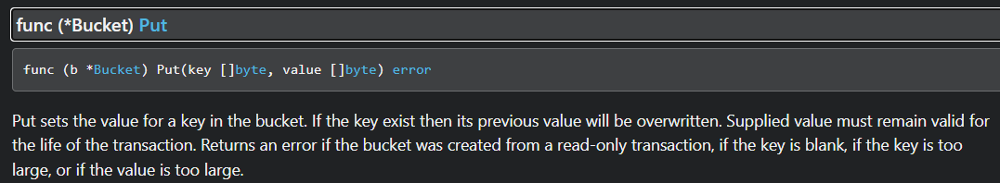

+++
date = '2025-04-14T10:28:30Z'
draft = true
title = 'Little and Big Endian in Go'
tags=['technical']
+++

Hey there, good to see you here.

I've picked up golang to learn this summer. so I thought building toy projects would be a good way to start with. In the process I stumbled upon [gophercises](https://courses.calhoun.io/courses/cor_gophercises) which is arguably one of the best resource to learn to while having fun

I was trying my hand at building a command line todo tool or task list [project in gophercises](https://courses.calhoun.io/lessons/les_goph_35). tbh it's pretty basic but i get to try out boltdb and the cobra tools which helps you in building command line applications faster.

so this blog (not very technical) is just me reading about it. if you already know about endianness and how juggle with numbers in go, this one is probably not for you (you should skip it)

## Two sides of Endianness

by now, i think , you are familiar with what endianness is and all, if not, [please go through this](https://youtu.be/LxvFb63OOs8?si=k-xFnk-Krqwklqdm)

our application is very basic, to over simplify , here is the usage

add a task

> todocli add <task_name>

do a task

> todocli do <task_id>

list all tasks

> todocli list

that's it, what'd i tell you, toy projects!

we use [boltdb](https://github.com/boltdb/bolt) to persist the tasks data.

as you have already guessed, the only code we need write is to `add` (write to the tasks db), `list` (read from the tasks db), `do` (delete from the tasks db) for now,we are not storing any completed tasks,we just delete them

i'll just paste the relevant pieces of code we need to write for `add` functionaly, on which i want focus on right now.

```go
func Add(task string) error{
		db, err := bolt.Open("tasks.db", 0600, nil)
		if err != nil {
			fmt.Println("Error opening database:", err)
			return err
		}
		defer db.Close()
		// add a new task to the db
		readWriteError := db.Update(func(tx *bolt.Tx) error {
			b, er := tx.CreateBucketIfNotExists([]byte("tasks"))
			if er != nil {
				return er
			}
			id, _ := b.NextSequence()
			fmt.Println(id)
			fmt.Println(itob(int(id)))
			err = b.Put(itob(int(id)), []byte(task))
			if err != nil {
				fmt.Printf("Could not write task to the database: %s", err)
				return err
			}
			return nil
		})
		if readWriteError != nil {
			fmt.Println("Error writing to database:", readWriteError)
			return readWriteError
		}
		fmt.Println("Task added:", task)
        return nil
	}
```

```go
func itob(v int) []byte {
	b := make([]byte, 8)
	binary.BigEndian.PutUint64(b, uint64(v))
	fmt.Println("itob:", v, b)
	return b
}
```

i'll simplify the things i don't want you to focus on.

```go
id, _ := b.NextSequence()
```

let's just say you already have 3 tasks in your db, and the task_id of the last task is 3. now when you try to add a new task, the `id` variable will have the value 4 indicating the next task's id that is to be added

let's focus on this piece of code

```go
err = b.Put(itob(int(id)), []byte(task))
```

if we take a step back and look at `Put` in boltdb's documentation, we'd find



looking by the signature ,we can make out that we need to provide a slice of bytes as our key and as our value

this is where we need to convert our task_id which is an integer to a slice of bytes. we can convert this into big endian representation or small endian representation while storing in the db

let's see how we can convert int into big endian and little endian representations

```go
package main

import (

        "fmt"
        "encoding/binary"
)

func itob(v int) ([]byte, []byte) {
        be := make([]byte, 8)
        le:= make([]byte, 8)
        binary.BigEndian.PutUint64(be, uint64(v))
        binary.LittleEndian.PutUint64(le, uint64(v))
        return be,le
}

func main(){

        x:=255
        be,le:= itob(x)
        fmt.Printf("value: %d, big endian representation: %v\n",x,be)
        fmt.Printf("value: %d, little endian representation: %v\n",x,le)
}
```

output

```
value: 255, big endian representation: [0 0 0 0 0 0 0 255]
value: 255, little endian representation: [255 0 0 0 0 0 0 0]
```

this is straight forward cause, `byte` is a synonym of `uint8` datatype in go, hence we can store a maximum of 255 in one instance of a byte

since 255 is represented as `1 1 1 1 1 1 1 1 1` now this byte when represented in big endian, (uint64, which occupies 8 bytes)
`00000000 00000000 000000000 000000000 000000000 000000000 000000000 11111111`

in big endian,the msb (most significant byte) occupies the lowest memory address, while in little endian, the lsb (least significant byte) occupies the lowest memory address

hence in big endian this becomes `0 0 0 0 0 0 0 255`, the same way little endian comes out as `255 0 0 0 0 0 0 0`

let's see one more example, `x=1921`

```
value: 1921, big endian representation: [0 0 0 0 0 0 7 129]
value: 1921, little endian representation: [129 7 0 0 0 0 0 0]
```

in `uint64` 1921 is represented as

`00000000 00000000 00000000 00000000 00000000 00000000 00000111 10000001`

i hope that, now it's corresponding big and little endian representations make sense

Alright, this is a very short, vauge blog. I wanted to write about something hence this exists.

Note: big endian is used here. It's often used in BoltDB for ordering purposes. BoltDB stores keys as []byte and compares them lexicographically (byte-by-byte from left to right). hence the numeric order of the keys is preserved naturally
